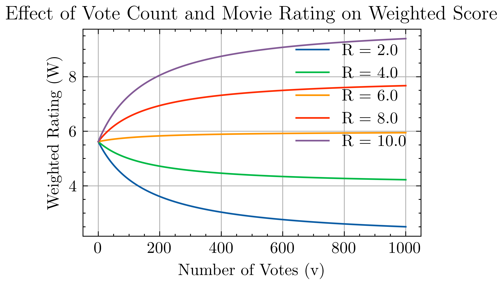

# 电影推荐系统

## 加权评分方法

为什么要定义一种加权的评分方法呢？如果我们只考虑评分R，那么有可能出现一种情况，就是有些电影的评分人数很少，但是评分很高，那么这种电影可能就是小众电影，但是因为评分高而被推荐给用户，这样就会导致推荐结果不准确。如果我们只考虑评分人数v，那么有可能出现一种情况，就是有些电影的评分人数很多，但是评分很低，那么这种电影可能就是烂片，但是因为评分人数多而被推荐给用户，这样也会导致推荐结果不准确。所以，我们需要一种加权的评分方法，既能反映电影的评分质量，又能反映电影的评分人数。

数据集的分布如下：

### 基础统计
| 统计项            | 值                  |
|--------------------|---------------------|
| 电影总数           | 45,463              |
| 年份范围           | 1874 - 2020         |
| 最高产年份         | 2014.0              |
| 平均评分           | 5.62 / 10           |
| 评分中位数         | 6.00 / 10           |
| 评分范围           | 0.0 - 10.0          |
| 平均投票次数       | 109.9               |
| 投票次数中位数     | 10.0                |
| 最高投票次数       | 14,075.0            |
| 平均时长           | 94.1 分钟           |
| 时长范围           | 0 - 1256 分钟       |

### 评分分布
| 评分 | 数量    | 占比   |
|------|---------|--------|
| 0.5  | 1,101   | 1.1%   |
| 1.0  | 3,326   | 3.3%   |
| 1.5  | 1,687   | 1.7%   |
| 2.0  | 7,271   | 7.3%   |
| 2.5  | 4,449   | 4.4%   |
| 3.0  | 20,064  | 20.1%  |
| 3.5  | 10,538  | 10.5%  |
| 4.0  | 28,750  | 28.7%  |
| 4.5  | 7,723   | 7.7%   |
| 5.0  | 15,095  | 15.1%  |

### 基础评分公式
\[ WR = \left(\frac{v}{v+m}\right) \cdot R + \left(\frac{m}{v+m}\right) \cdot C \]

**参数说明**：
- `C`：全平台电影平均分（基准线）
- `m`：最小有效投票阈值
- `v`：当前电影实际投票数
- `R`：当前电影原始平均分

### 参数分析

由于均值是评分5.62，当R小于5.62的时候，评分人数越多，WR越小，当R大于5.62的时候，评分人数越多，WR越大。

---

## 相似性推荐

核心思路：对剧情文本进行清洗，然后向量化，然后计算余弦相似度。

向量化的方法由简单到复杂，我们计划使用tf-idf，然后使用bert。

### 向量化：TF-IDF

**核心步骤**：
1. 对原始剧情文本进行命名实体清洗
2. 使用TF-IDF算法进行向量化
3. 计算剧情向量间的余弦相似度
4. 基于相似度排序，生成Top-K推荐

**核心算法**：
- TF-IDF权重计算：
  \[ w_{ij} = \mathrm{TF}(t_j,d_i) \times \log\frac{N}{\mathrm{DF}(t_j)} \]
- 余弦相似度：与文本长度无关
  \[ \cos(\theta) = \frac{\vec{A} \cdot \vec{B}}{\|\vec{A}\| \|\vec{B}\|} \]

## 关联规则推荐
### FP-Growth算法流程

**实现步骤**：
1. 转换用户行为数据为交易数据集
2. 构建FP-Tree压缩数据结构
3. 递归挖掘频繁项集
4. 生成高质量关联规则
5. 根据规则指标进行筛选和排序

**规则质量指标**：
- 支持度：\(\frac{\text{包含X∪Y的记录数}}{\text{总记录数}}\)
- 置信度：\(\frac{\text{支持度(X∪Y)}}{\text{支持度(X)}}\)
- 提升度：\(\frac{\text{置信度}}{\text{支持度(Y)}}\)

**应用策略**：
- 最小支持度：0.06
- 最小置信度：0.3
- 规则排序：置信度优先

fp-tree离线生成，用户输入电影名称，我们查询挖掘到的规则中，以该电影为前件的规则，然后根据置信度排序，生成Top-K推荐。

更进一步，我们可以允许前件有多个电影，用户的输入也可以是多个。

---

## 4. 深度学习推荐
### RoBERTa模型应用

**技术路线**：
1. 采用Huggingface上的轻量级RoBERTa预训练模型
2. 对电影剧情文本进行语义向量编码
3. 使用余弦相似度计算电影语义相似性
4. 生成基于深度语义的推荐结果

---

## 5. 混合推荐策略

**综合评分公式**：
\[ Score_{final} = \alpha \cdot WR + (1-\alpha) \cdot Similarity \]

或者是

\[ Score_{final} = \alpha \cdot WR + (1-\alpha) \cdot Confidence \]
其中：
- WR为加权评分方法得分
- Similarity为相应推荐方法的相似度分数
- α为平衡参数，控制评分与相似度（置信度）的权重

