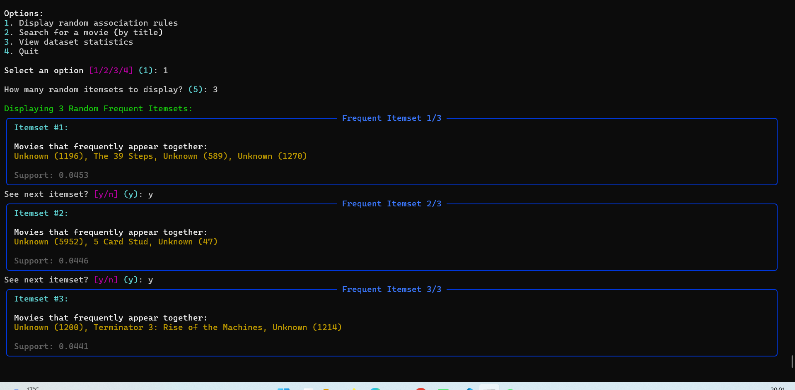
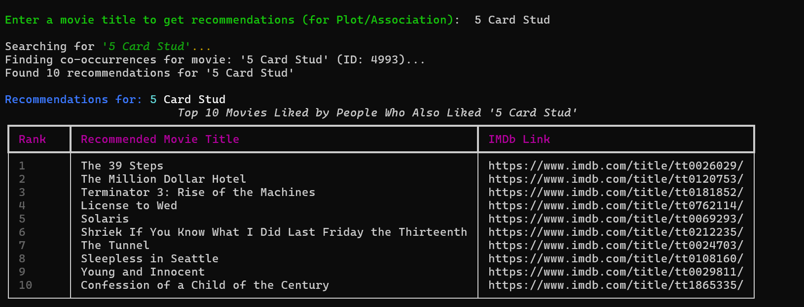

# 频繁项集推荐器 (Association Recommender)

## 频繁项集推荐器原理

频繁项集推荐器基于在大型数据集中发现项之间的有趣关系。其核心思想是识别经常一起出现的模式（项集），然后利用这些模式来预测用户可能感兴趣的其他项。

关键概念包括：

*   **项集 (Itemset):** 一组一起出现的项目（例如，一组电影）。一个项集可能代表用户同时“喜欢”的多部电影。
*   **事务 (Transaction):** 一次用户交互中涉及的项集。例如，一个用户“喜欢”的所有电影可以构成一个事务。
*   **支持度 (Support):** 指某个项集在所有事务中出现的频率。计算公式为：
    `Support(X) = (包含X的事务数) / (总事务数)`
    在代码中，[`min_support`](../../src/recommenders/association_recommender.py) 参数用于 [`fpgrowth` 算法](../../src/recommenders/association_recommender.py)中，以筛选出足够频繁的项集。只有达到此最小支持度阈值的项集才被认为是“频繁的”。
*   **置信度 (Confidence):** 指规则 `X -> Y` 的可靠性，即当项集X出现时，项集Y也出现的概率。计算公式为：
    `Confidence(X -> Y) = Support(X U Y) / Support(X)`
    虽然代码中 [`min_confidence`](../../src/recommenders/association_recommender.py) 在类的 [`__init__` 方法](../../src/recommenders/association_recommender.py)中定义，但当前的推荐逻辑主要基于频繁项集的共现，而不是直接使用置信度来过滤生成的规则。
*   **提升度 (Lift):** 指规则 `X -> Y` 的有趣程度，衡量X的出现对Y出现的概率提升了多少。`Lift > 1` 表示X的出现与Y的出现呈正相关。计算公式为：
    `Lift(X -> Y) = Support(X U Y) / (Support(X) * Support(Y))`
    与置信度类似，[`min_lift`](../../src/recommenders/association_recommender.py) 在 [`__init__` 方法](../../src/recommenders/association_recommender.py)中定义，但当前推荐逻辑并不主动使用它来筛选规则。

**举例说明:**
假设通过分析用户数据，我们发现很多用户同时喜欢《电影A》和《电影B》。这意味着《电影A》和《电影B》构成了一个频繁项集。那么，当一个新用户表示喜欢《电影A》时，系统就可以基于这个已发现的关联，向该用户推荐《电影B》。

## 代码详解

### 生成频繁项集

当前的Python代码 ([`src/recommenders/association_recommender.py`](../../src/recommenders/association_recommender.py)) 主要使用 [`fpgrowth` 函数](../../src/recommenders/association_recommender.py)直接从用户事务中挖掘*频繁项集*（即用户经常一起喜欢的电影组合）。它并不像传统关联规则挖掘那样显式地生成 "X -> Y" 形式的规则，并用置信度和提升度进行过滤。推荐是基于这些频繁项集中的共现关系得出的。

关键步骤包括：
1.  **编码用户事务**: 将用户的“喜欢”记录（即事务）转换为适合 [`fpgrowth`](../../src/recommenders/association_recommender.py) 算法处理的格式。
2.  **运行 FP-Growth**: 应用 [`fpgrowth`](../../src/recommenders/association_recommender.py) 算法找出频繁项集。

```python
# src/recommenders/association_recommender.py
from mlxtend.preprocessing import TransactionEncoder
from mlxtend.frequent_patterns import fpgrowth

# 1. Encode transactions for FP-Growth (Simplified from fit method)
# transactions = liked_ratings.groupby('userId')['movieId'].apply(list).tolist()
encoder = TransactionEncoder()
encoded_data = encoder.fit_transform(transactions) # 'transactions' would be list of lists of movie IDs
df_encoded = pd.DataFrame(encoded_data, columns=encoder.columns_)

# 2. Run FP-Growth to find frequent itemsets
frequent_itemsets = fpgrowth(
    df_encoded,
    min_support=self.min_support, # e.g., 0.04
    use_colnames=True
)
```

该代码首先对用户事务（用户喜欢的电影列表）进行编码，然后调用FP-Growth算法。通过设置 `min_support`（最小支持度），算法会筛选出那些在足够多用户事务中共同出现的电影组合（频繁项集）。

### 推荐电影

[`recommend` 方法](../../src/recommenders/association_recommender.py#L34) 根据用户输入的电影，在已发现的频繁项集中寻找共现模式来进行推荐。其工作流程如下：

1.  根据输入的电影标题找到对应的 `movie_id`。
2.  遍历 [`fit` 方法](../../src/recommenders/association_recommender.py#L46)生成的 `self.frequent_itemsets`。
3.  对于每个包含输入 `movie_id` 的频繁项集，该项集中的其他电影被视为潜在的推荐。这些电影的推荐分数会根据它们与输入电影共同出现的频繁项集的 `support`（支持度）进行累加。
4.  最后，这些潜在推荐会根据一个 `final_score` 进行排序。这个分数结合了累加的 `support` 和电影本身的 [`weighted_rating`](src/recommenders/association_recommender.py:220)（如果元数据中包含评分和投票数信息）。返回得分最高的N部电影。

以下是 [`recommend` 方法](src/recommenders/association_recommender.py:144)中说明此过程的关键代码片段：

```python
# 从 src/recommenders/association_recommender.py 的 recommend 方法节选

# 1. 遍历频繁项集寻找共现电影
for _, itemset_row in self.frequent_itemsets.iterrows():
    items = itemset_row['itemsets']
    if movie_id in items and len(items) > 1:
        for other_movie_id in items:
            if other_movie_id != movie_id:
                # co_occurring_movies[other_movie_id] += itemset_row['support']
                pass # Simplified for illustration

# 2. 计算最终得分（结合支持度和加权评分）
final_score = support * w_score # w_score from weighted_rating
recommendations.append((title, imdb_id, final_score))
```

该方法首先识别出与输入电影一同出现在频繁项集中的其他电影。然后，它会计算一个综合分数，该分数不仅考虑了共现的强度（通过支持度体现），还考虑了电影本身的受欢迎程度和评价（通过加权评分）。

## 参数分析

以下是影响推荐器行为的关键参数，这些参数在当前 [`src/recommenders/association_recommender.py`](../../src/recommenders/association_recommender.py) 的代码逻辑中起作用：

*   **`min_support` (最小支持度):** 在 [`fpgrowth` 算法](../../src/recommenders/association_recommender.py#L97)中使用，这个参数至关重要，它定义了一个项集（电影组合）必须在多大比例的用户事务中出现才被认为是“频繁的”。较低的 `min_support` 值会发现更多、更小众的模式，但可能会包含一些偶然的关联。较高的值则侧重于更普遍、更受欢迎的电影组合。
*   **`rating_threshold` (评分阈值):** 在 [`fit` 方法](../../src/recommenders/association_recommender.py#L70)中使用，此参数决定了用户的哪些电影评分被视为“喜欢”。只有评分达到或超过此阈值的电影才会被包含在用户的事务中，用于后续的频繁项集挖掘。

类中还定义了 `min_confidence` (最小置信度) 和 `min_lift` (最小提升度) 参数。虽然这些是关联规则挖掘中的经典度量，但当前版本的推荐逻辑主要依赖于从频繁项集中直接识别共现关系，并结合加权评分进行排序，而不是显式地生成 "X -> Y" 规则并使用这两个参数进行过滤。

## 分析

### 优点
关联规则（或在此代码中更准确地说是频繁项集分析）的一个主要优点是它可以仅基于用户行为数据（如电影“喜欢”记录）发现模式，而无需用户的人口统计学信息或其他显式特征。挖掘出的频繁项集（“这些电影经常被一起喜欢”）直观易懂。通过调整 `min_support` 和 `rating_threshold` 等参数，可以控制挖掘过程的敏感度和结果的粒度。

### 改进方向
*   **加入个性化元素**：当前的实现为所有用户使用同一套挖掘出的频繁项集。未来的改进可以考虑引入用户特征，例如，根据用户的历史评分习惯动态调整 `rating_threshold`，或者在推荐时根据用户画像对从频繁项集中选出的候选项进行重新排序。
*   **优化项集的生成与使用**：可以考虑对特别热门或冷门的电影在项集生成阶段进行特殊处理，或者对包含过多项目的频繁项集进行剪枝，以提高推荐的相关性和效率。

## 结果展示

下图展示了频繁项集推荐器的运行效果。

第一张图片对应的是命令行界面中选择“1. Display random association rules”选项后的输出。它展示了用户选择显示3个随机频繁项集的结果。每个项集列出了共同出现的电影（部分因ID未知而显示为 "Unknown"）及其计算出的“支持度（support）”值。这部分功能由代码中的 [`get_random_rules` 方法](../../src/recommenders/association_recommender.py#L263)实现，该方法用于检索并展示随机选择的频繁项集信息。



第二张图片则显示了当用户输入电影标题（例如图中的 "5 Card Stud"）后，系统执行推荐的场景。输出结果是一个包含10部推荐电影的列表，每部电影都附有其IMDb链接。这些推荐是基于与输入电影共同出现在频繁项集中的其他电影，并根据综合评分排序得到的。此功能由代码中的 [`recommend` 方法](../../src/recommenders/association_recommender.py#L144)实现。



**关于数据集的说明：**

FP-Growth算法在构建FP树时是递归的，对内存有较高要求。因此，示例中可能使用了较小的数据集，例如 `ratings_small.csv`（包含约700个用户的10万条评分，涉及9000部电影），而不是完整的 `ratings.csv` 数据集（包含约27万用户的2600万条评分，涉及45000部电影）。如果使用的电影元数据（`metadata_df`）与这个较小数据集中的电影ID不完全对应，那么在频繁项集或推荐结果中可能会出现 "Unknown (movie_id)" 的情况，表示某个电影ID存在于频繁项集中，但在当前的电影ID到标题的映射中找不到对应的电影名称。