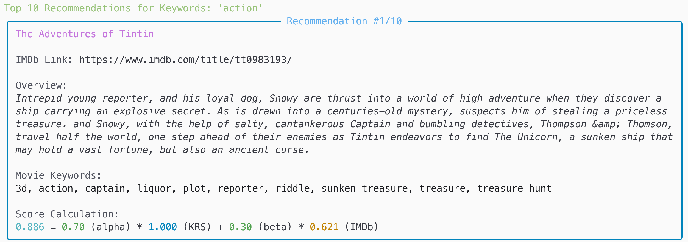

# 关键词电影推荐系统实验报告

## 引言 (Introduction)

### 项目背景与目的
电影推荐系统对于提升用户在海量影片中的发现体验至关重要。本项目旨在构建一个基于关键词的电影推荐器，通过结合用户输入的关键词与电影的固有属性（如流行度、内容相关性）来进行推荐。本实验报告将详细阐述该推荐器的原理、核心代码实现、运行方式，并讨论其结果、优缺点及未来改进方向。

### 数据集说明
本推荐系统使用的数据主要包括：
*   **电影元数据**: 包含电影ID、标题、概述、平均评分 (`vote_average`)、投票数 (`vote_count`)等。
*   **电影关键词数据**: 记录每部电影关联的关键词列表。


## 关键词推荐器原理 (Principle of the Keyword Recommender)

关键词推荐系统的核心思想是结合用户明确表达的兴趣（通过输入的关键词）与电影本身固有的属性（如流行度、内容相关性）来进行综合推荐。

其主要实现步骤如下：

### 关键词处理与逆文档频率 (IDF) 计算
1.  **关键词提取**: 从关键词数据中解析出每部电影的关键词集合。此步骤由 `_parse_keyword_string` 方法完成。
2.  **IDF值计算**: 计算每个独立关键词的逆文档频率 (IDF) 以评估其重要性。公式如下：

    $$IDF(\text{keyword}) = \log\left(\frac{N + 1}{df_{\text{keyword}} + 1}\right) + 1$$

    其中：
    *   $N$ 是电影总数。
    *   $df_{\text{keyword}}$ 是包含该关键词的电影数量。
    此逻辑在 `_calculate_idf` 方法中实现。

### 电影加权评分计算 (IMDB-style Weighted Score)
为了评估电影的整体质量和受欢迎程度，系统采用IMDB式的加权评分，综合考虑平均评分 (`vote_average`) 和投票数 (`vote_count`)，并进行归一化。此功能由 [`../../src/utils/weighted_score.py`](../../src/utils/weighted_score.py) 函数提供，并在 `KeywordRecommender` 的 `fit` 方法中调用。

### 用户查询与关键词相关性评分 (KRS)
当用户输入查询关键词时：
1.  **用户关键词解析**: 将输入字符串解析为关键词集合。
2.  **匹配与KRS计算**: 计算电影的关键词相关性评分 (KRS)：

    $$KRS(\text{movie}) = \sum IDF(\text{matched\_keyword})$$

    即电影所有匹配关键词的IDF值之和。
3.  **KRS归一化**: 将KRS归一化到0-1范围。

### 最终推荐分数计算与排序
结合关键词相关性与电影质量计算最终分数：
*   **最终分数 (Final Score)**:

    $$FinalScore(\text{movie}) = \alpha \times KRS(\text{movie}) + \beta \times IMDB\_Score(\text{movie})$$

    其中 $\alpha$ 和 $\beta$ 是权重参数，控制关键词匹配精确度与电影流行度的相对重要性。
*   **生成推荐**: 电影根据最终分数降序排序，返回Top-N结果。
此流程在 `recommend` 方法中实现。

## 核心代码解析 (Core Code Analysis)

本章节将选取 [`src/recommenders/keyword_recommender.py`](../../src/recommenders/keyword_recommender.py) 文件中的关键 Python 代码片段进行展示和解析，以阐明关键词推荐器的内部实现细节。

### IDF计算 (`_calculate_idf`)
该方法计算数据集中所有独立关键词的逆文档频率 (IDF)。

```python
    def _calculate_idf(self, all_movie_keyword_sets: pd.Series):
        # ... (初始化和统计 keyword_doc_frequency, 即各关键词在多少电影中出现)
        total_movies = len(all_movie_keyword_sets)
        self.idf_scores = {} # 用于存储计算得到的IDF值
        for keyword, doc_freq in keyword_doc_frequency.items():
            # IDF核心公式: log((总电影数 + 1) / (含该关键词的电影数 + 1)) + 1
            self.idf_scores[keyword] = math.log((total_movies + 1) / (doc_freq + 1)) + 1
```

此方法为每个关键词计算逆文档频率 (IDF)。它首先统计每个关键词在多少部电影文档中出现过（文档频率 `df`），然后基于 `df` 和总电影数，使用公式 `log((总电影数 + 1) / (df + 1)) + 1` 计算出每个关键词的IDF值。IDF值较高的关键词通常被认为更具区分度，对于识别特定主题的电影更为重要。

### 数据拟合/准备 (`fit`)
`fit` 方法是推荐器进行数据预处理和计算必要评分（如IDF、IMDB加权分）的入口。

```python
    def fit(self, metadata_df: pd.DataFrame, keywords_data_path: str = 'dataset/keywords.csv') -> bool:
        # 1. 加载和解析关键词 (概念性展示主要步骤)
        #    keywords_df = pd.read_csv(keywords_data_path)
        #    self.movie_keyword_sets = ... apply(self._parse_keyword_string from keywords_df) ...
        # 2. 计算IDF分数
        self._calculate_idf(self.movie_keyword_sets)
        # 3. 计算归一化的IMDB分数
        self.normalized_imdb_scores = calculate_normalized_weighted_scores(self.metadata_df, ...)['normalized_scores']
        self._fitted = True # 标记推荐器已准备就绪
```

`fit` 方法负责初始化推荐器并准备其运行所需的核心数据。它主要执行以下操作：
1.  处理传入的电影元数据 (`metadata_df`)，并从指定路径加载电影关键词数据。
2.  为数据集中的每部电影提取并关联其关键词集合 (存储在 `self.movie_keyword_sets`)。
3.  调用前述的 `_calculate_idf` 方法，计算数据集中所有独立关键词的IDF值。
4.  调用外部的 `calculate_normalized_weighted_scores` 函数，根据电影的评分和投票数计算IMDB式的加权评分，并进行归一化。
完成这些步骤后，推荐器被标记为“已拟合” (`_fitted = True`)，表明其已准备好生成推荐。

### 生成推荐 (`recommend`)
此方法是推荐器的核心，根据用户输入的关键词生成电影推荐列表。

```python
    def recommend(self, user_keywords_str: str, top_n: int = 10) -> pd.DataFrame:
        user_keywords = {kw.strip().lower() for kw in user_keywords_str.split(',')} # 1. 解析用户输入关键词
        # 2. 为每部电影计算关键词相关性评分(KRS)并归一化 (概念性展示)
        #    krs = sum(self.idf_scores.get(kw, 0) for kw in (user_keywords & movie_keywords_set))
        self.metadata_df['normalized_krs'] = self._calculate_and_normalize_krs(user_keywords)
        # 3. 计算最终推荐分数
        self.metadata_df['final_score'] = (self.alpha * self.metadata_df['normalized_krs'].fillna(0)) + \
                                          (self.beta * self.metadata_df['normalized_imdb_score'].fillna(0))
        # 4. 排序并返回Top-N结果
        return self.metadata_df.sort_values(by='final_score', ascending=False).head(top_n)
```

此方法是推荐器的核心功能，用于根据用户输入的关键词字符串生成电影推荐列表。其主要流程如下：
1.  将用户输入的关键词字符串（例如 "action, comedy"）解析为一个标准化的关键词集合。
2.  计算每部电影的“关键词相关性评分 (KRS)”。这通常涉及到找出该电影的关键词与用户关键词的交集，并累加这些匹配关键词的IDF值。之后，KRS值会进行归一化处理（由 `_calculate_and_normalize_krs` 辅助方法完成）。
3.  使用预设的权重参数 `alpha` (关键词相关性权重) 和 `beta` (电影流行度权重)，将每部电影的归一化KRS与之前在 `fit` 方法中计算好的归一化IMDB评分进行加权求和，得到最终的推荐分数 (`final_score`)。
4.  所有电影根据此 `final_score` 进行降序排序，并选取分数最高的 `top_n` 部电影作为推荐结果返回。

## 实验设置与结果展示 (Experiment Setup & Results)

本章节将描述运行关键词推荐系统的实验环境、启动参数，并通过具体的命令行示例来展示其交互方式和预期的输出结果。

### 启动推荐系统与参数说明
关键词推荐器通过项目根目录下的 [`src/main.py`](../../src/main.py) 脚本启动。运行该脚本时，需要指定 `keyword` 作为推荐器类型。

**基本启动命令**:

```bash
python src/main.py keyword
```

### 测试用例与命令行示例

**计划测试的关键词场景与示例**:

**场景 1: 测试常见、高频关键词**
*   **目的**: 观察推荐系统如何处理广泛存在于多部电影中的常见关键词，以及 `alpha` 和 `beta` 权重如何影响这类查询的结果。
*   **示例关键词输入**:
    *   `action`
    *   `comedy`
    *   `drama`
    *   `love`

    
    
    


**场景 2: 测试常见关键词的组合**
*   **目的**: 检验系统处理多个常见关键词组合的能力，观察推荐结果是否能较好地反映这些关键词的交集特性。
*   **示例关键词输入**:
    *   `action, comedy`
    *   `drama, romance`
    *   `sci-fi, adventure`

    
    
    
    

**场景 3: 测试不常见关键词的组合**
*   **目的**: 观察系统如何处理多个不常见关键词的组合，这可能导致非常小众或精确的推荐结果。
*   **示例关键词输入**:
    *   `dystopia, mockumentary`
*   **命令行示例**:
    ```bash
    python src/main.py keyword --alpha 0.8 --beta 0.2
    ```


## 讨论 (Discussion)

本章节将对关键词推荐器的特性、参数影响、优点和局限性进行讨论。

### 参数影响分析

关键词推荐器的核心行为受以下关键参数影响：

*   **`alpha` 和 `beta` 权重**:
    *   这两个参数用于平衡关键词相关性评分 (Normalized KRS) 和电影IMDB加权评分 (Normalized IMDB Score) 在最终推荐分数中的占比。
    *   高 `alpha` 值侧重关键词匹配度，适合有明确关键词偏好的用户。
    *   高 `beta` 值侧重电影的IMDB评分，倾向于推荐大众认可的高分或热门电影。
    *   均衡的 `alpha` 和 `beta` (如默认 `alpha=0.7, beta=0.3`) 则在两者间寻求平衡，略偏向关键词匹配。

*   **`vote_count_percentile` (用于IMDB评分计算)**:
    *   此参数通过选取数据集中电影投票数的一个分位数，来确定IMDB加权评分公式中的最小投票数阈值 (`m`)。
    *   `m` 值用于确保只有获得足够多投票数的电影才能在加权评分中占据显著权重，从而提升评分的可靠性。
    *   较高的 `vote_count_percentile` (如 `0.90`, `0.95`) 会设定更严格的投票数门槛，侧重于经过广泛评价的电影，可能排除小众佳片。
    *   较低的 `vote_count_percentile` (如 `0.70`, `0.50`) 则更具包容性，会纳入投票数较少的电影，但可能引入评分数据不够稳健的影片。
    *   该参数主要影响 `normalized_imdb_score` 的计算，进而影响最终的 `final_score`。

### 推荐器优点

*   **直观且易于理解**: 用户通过输入自己感兴趣的关键词来获取推荐，这种交互方式非常直接。推荐结果也可以通过展示匹配的关键词和各项得分（KRS、IMDB分）来提供一定的可解释性。
*   **对冷启动友好**: 对于新用户，系统不需要其历史行为数据即可进行推荐，只需要用户提供当前的兴趣关键词。这解决了许多推荐系统中常见的用户冷启动问题。对于新加入系统的电影，只要其关键词被正确索引，也能很快被推荐出来。


### 推荐器局限性

*   **关键词的字面匹配**:
    *   当前的实现主要基于关键词的字面完全匹配。它无法理解同义词（如 "sci-fi" vs "science fiction" 如果未统一处理）、近义词或更深层次的语义关联。用户可能需要输入非常精确的关键词才能获得最佳匹配。
    *   对于用户输入的多关键词查询，当前是简单地将匹配到的关键词IDF值相加，没有考虑关键词之间的顺序或组合关系。
*   **结果多样性可能不足**: 如果某些高IDF的关键词或高IMDB评分的电影主导了推荐分数，可能会导致推荐结果的集中化，缺乏多样性。
