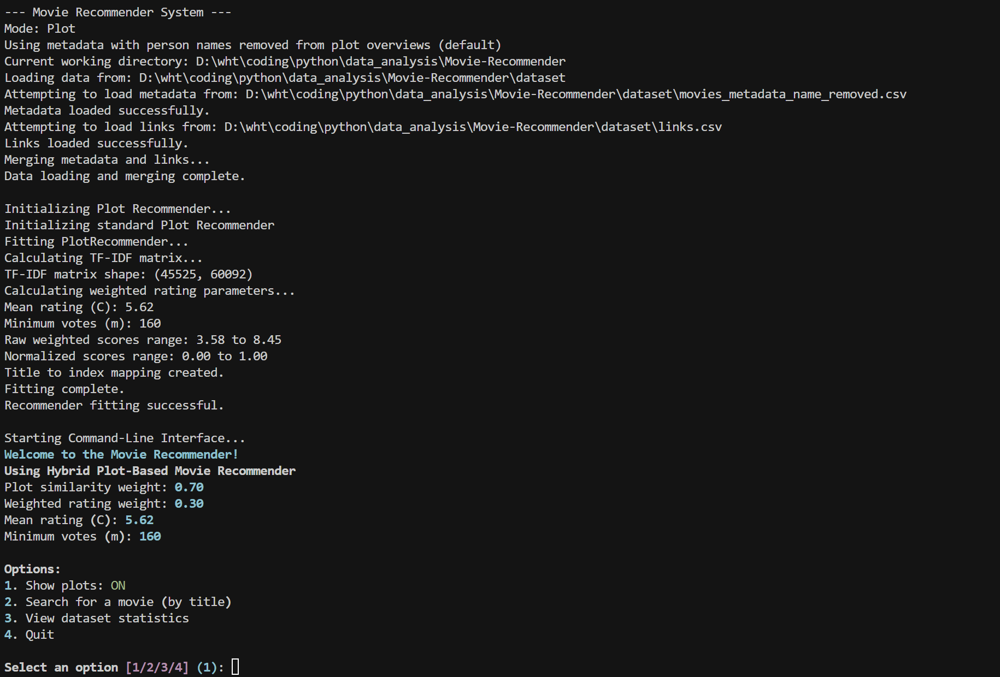
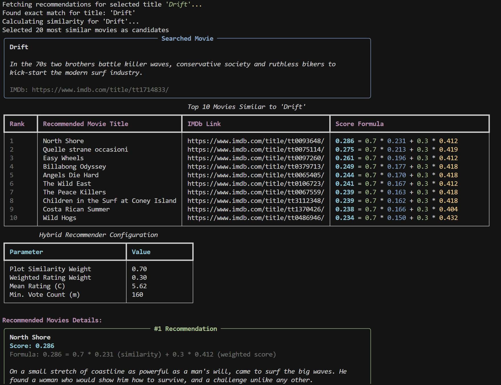

# 情节相似度推荐器 (Plot Recommender) 

## 1. 概述

情节相似度推荐器是一个基于内容的电影推荐系统，它通过分析电影剧情文本的相似度来推荐电影。该系统结合了TF-IDF文本分析、余弦相似度计算和加权评分公式，以提供高质量的推荐结果。

## 2. 技术原理

### 2.1 TF-IDF 文本分析

TF-IDF (Term Frequency-Inverse Document Frequency) 是一种用于文本特征提取的统计方法。

#### 2.1.1 数学公式

1. 词频(TF):
$$TF(t,d) = \frac{f(t,d)}{\sum_k f(k,d)}$$

其中:
- `f(t,d)` 是词 t 在文档 d 中出现的次数
- 分母是文档 d 中所有词的出现次数之和

2. 逆文档频率(IDF):
$$IDF(t) = \log\left(\frac{N}{DF(t)}\right)$$

其中:
- `N` 是文档总数
- `DF(t)` 是包含词 t 的文档数量

3. TF-IDF 得分:
$$TF\text{-}IDF(t,d) = TF(t,d) \times IDF(t)$$

通过TF-IDF计算,我们可以量化每个词项在文档集合中的统计重要性。该指标不仅考虑了词项在单个文档中的出现频率,还通过IDF因子平衡了其在整个语料库中的普遍程度,从而有效识别对文档语义表达具有显著贡献的关键词。这种方法为后续的文本相似度计算提供了可靠的特征表示基础。

#### 2.1.2 TF-IDF矩阵化

对于电影情节文本集合,TF-IDF矩阵化过程如下:

1. 首先构建词汇表V,包含所有电影情节中出现的独特词项
2. 对每部电影的情节文本d,计算其中每个词项t的TF-IDF值
3. 生成矩阵M,其中:
   - 行表示不同的电影
   - 列表示词汇表中的词项
   - 矩阵元素M[i,j]表示第i部电影中第j个词项的TF-IDF值

例如,对于包含n部电影和m个词项的语料库,会生成一个n×m的矩阵:

$$
M = \begin{bmatrix}
w_{1,1} & w_{1,2} & \cdots & w_{1,m} \\
w_{2,1} & w_{2,2} & \cdots & w_{2,m} \\
\vdots & \vdots & \ddots & \vdots \\
w_{n,1} & w_{n,2} & \cdots & w_{n,m}
\end{bmatrix}
$$

其中w_{i,j}表示第i部电影中第j个词的TF-IDF权重。

这种矩阵表示使得我们可以:
- 将每部电影表示为m维向量空间中的一个点
- 通过比较向量来计算电影间的相似度
- 使用向量运算进行高效的相似度计算

这个TF-IDF矩阵为后续使用余弦相似度计算电影间的相似程度提供了基础。通过计算矩阵中任意两行向量的余弦相似度,我们就能得到对应两部电影在情节内容上的相似程度。


### 2.2 余弦相似度

余弦相似度是衡量两个向量相似程度的重要指标。在电影推荐系统中,我们使用余弦相似度来计算两个电影TF-IDF向量之间的相似程度。

#### 2.2.1 数学原理

余弦相似度通过计算两个向量之间的夹角余弦值来度量它们的相似性:

$$
\cos(\theta) = \frac{A \cdot B}{\|A\| \times \|B\|}
$$


其中:
- `A·B` 是向量点积,计算公式为
- `||A||` 和 `||B||` 是向量的欧几里得范数,计算公式为

余弦相似度的特点:
1. 适合处理文本向量,因为文本长度差异不应影响相似度
2. 能有效处理高维稀疏向量
3. 计算效率高，适合大规模相似度计算


### 2.3 加权评分公式

为了平衡电影质量和相似度，系统使用了一个加权评分公式，见 [Simple Recommender](../recommenders/simple_recommender.md)

## 3. 核心代码实现

### 3.1 初始化

```python
def __init__(self, similarity_weight: float = 0.7, vote_count_percentile: float = 0.90):
    self.tfidf_vectorizer = TfidfVectorizer(stop_words='english')
    self.tfidf_matrix = None
    self.indices = None
    self.titles = None
    self.metadata = None
    
    # 加权评分参数
    self.similarity_weight = similarity_weight
    self.vote_count_percentile = vote_count_percentile
    self.C = None  # 所有电影的平均评分
    self.m = None  # 最小投票数要求
    self.weighted_scores = None  # 预计算的加权评分
    self.normalized_scores = None  # 预计算的归一化评分
```

### 3.2 模型训练

```python
def fit(self, metadata_df: pd.DataFrame):
    # 检查必要列
    required_columns = ['overview', 'title', 'vote_average', 'vote_count']
    missing_columns = [col for col in required_columns if col not in metadata_df.columns]
    if missing_columns:
        raise ValueError(f"Metadata DataFrame missing required columns: {missing_columns}")

    # 处理空值
    metadata_df['overview'] = metadata_df['overview'].fillna('')

    # 计算TF-IDF矩阵
    self.tfidf_matrix = self.tfidf_vectorizer.fit_transform(metadata_df['overview'])

    # 计算加权评分参数
    weighted_scores_result = calculate_normalized_weighted_scores(
        metadata_df,
        vote_count_percentile=self.vote_count_percentile
    )

    # 存储计算结果
    self.C = weighted_scores_result['C']
    self.m = weighted_scores_result['m']
    self.weighted_scores = weighted_scores_result['scores']
    self.normalized_scores = weighted_scores_result['normalized_scores']

    # 创建标题到索引的映射
    metadata_df = metadata_df.reset_index()
    self.metadata = metadata_df
    self.titles = self.metadata['title']
    self.indices = pd.Series(self.metadata.index, index=self.metadata['title']).drop_duplicates()
```

### 3.3 推荐生成

```python
def recommend(self, movie_title: str, top_n: int = 10):
    # 检查模型是否已训练
    if self.tfidf_matrix is None or self.indices is None:
        return None

    # 查找电影索引
    if movie_title in self.indices:
        idx = self.indices[movie_title]
    else:
        # 模糊匹配
        fuzzy_matches = find_top_fuzzy_matches(movie_title, self.indices.index.unique().tolist())
        if fuzzy_matches:
            return [match[0] for match in fuzzy_matches]
        return None

    # 计算余弦相似度
    tfidf_vector = self.tfidf_matrix[idx]
    cosine_similarities = linear_kernel(tfidf_vector, self.tfidf_matrix).flatten()
    
    # 获取相似度分数并排序
    sim_scores = list(enumerate(cosine_similarities))
    sim_scores_sorted = sorted(sim_scores, key=lambda x: x[1], reverse=True)
    
    # 选择候选电影
    candidate_count = min(top_n + 10, len(sim_scores_sorted) - 1)
    top_similar_movies = sim_scores_sorted[1:candidate_count+1]
    
    # 计算最终得分
    combined_scores = []
    for movie_idx, similarity in top_similar_movies:
        norm_weighted_score = self.normalized_scores.iloc[movie_idx]
        combined_score = ((1 - self.similarity_weight) * norm_weighted_score) + \
                        (self.similarity_weight * similarity)
        combined_scores.append((movie_idx, combined_score, similarity, 
                              self.weighted_scores.iloc[movie_idx], 
                              norm_weighted_score))
    
    # 排序并返回结果
    combined_scores = sorted(combined_scores, key=lambda x: x[1], reverse=True)
    combined_scores = combined_scores[:top_n]
    
    # 构建推荐结果
    recommendations = []
    for movie_idx, combined_score, similarity, raw_weighted_score, norm_weighted_score in combined_scores:
        title = self.metadata.iloc[movie_idx]['title']
        imdb_id = self.metadata.iloc[movie_idx]['imdb_id_full']
        original_rating = self.metadata.iloc[movie_idx]['vote_average']
        
        recommendations.append((
            title,
            imdb_id,
            round(combined_score, 3),
            round(similarity, 3),
            round(norm_weighted_score, 3),
            round(original_rating, 1)
        ))

    return recommendations
```

## 4. 系统集成

### 4.1 数据流

1. 数据加载：
   - 从 `data_loader.py` 加载电影元数据
   - 支持原始和处理后的数据版本

2. 数据预处理：
   - 使用 `preprocess_metadata.py` 处理文本
   - 移除人名等干扰信息

3. 推荐生成：
   - 使用 `plot_recommender.py` 生成推荐
   - 结合多个评分维度

### 4.2 工具集成

1. 模糊搜索：
   - 使用 `fuzzy_search.py` 进行模糊匹配
   - 提高用户体验

2. 评分计算：
   - 使用 `weighted_score.py` 计算加权评分
   - 平衡电影质量和相似度

3. 用户界面：
   - 使用 `cli.py` 提供命令行界面
   - 支持交互式推荐

## 5. 功能展示

在main函数中，我们可以对`plot_recommender`进行调用。在终端中输入指令(需要在根目录下进行操作，同时main函数默认推荐算法选项即为plot，无需额外参数，如需显式指定，也可以输入参数`plot`)：

```bash
python src/main.py plot
```

即可打开可交互界面（UI）



用户可以控制搜索结果中是否展示详细的电影情节（功能1）

用户可以输入电影名来搜索情节推荐算法推荐的前10部电影（功能2）


用户也可以浏览当前数据集的整体统计结果（功能3）

<p align="center">
  
  
</p>

如果所搜索的电影名不在数据库中，系统会进行模糊搜索，识别其中的关键词，搜索相似电影名，然后重复功能2的过程。


